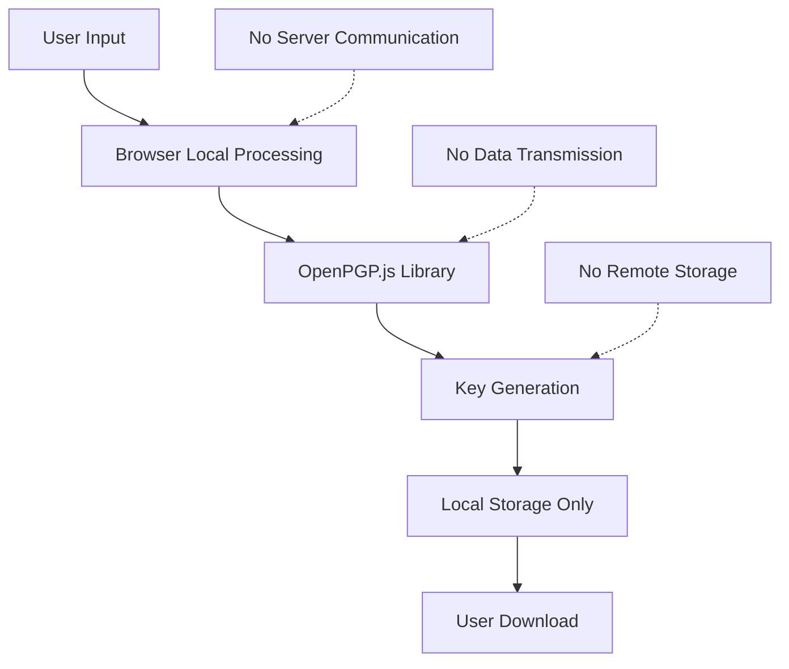
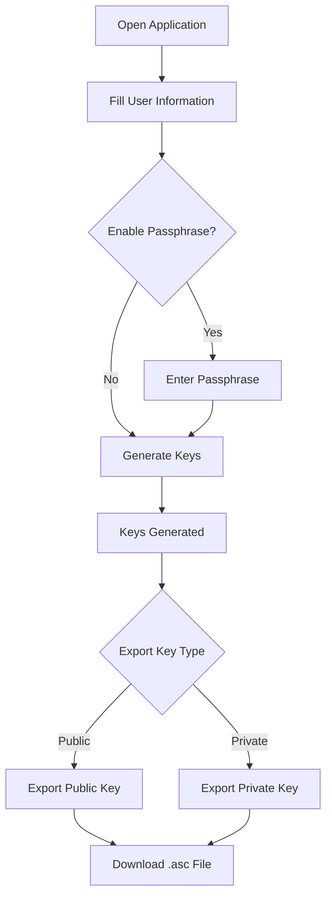
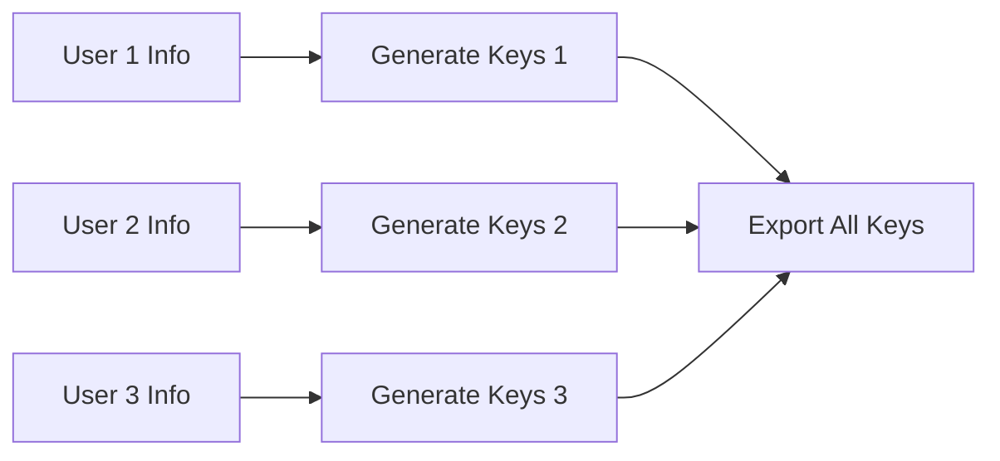
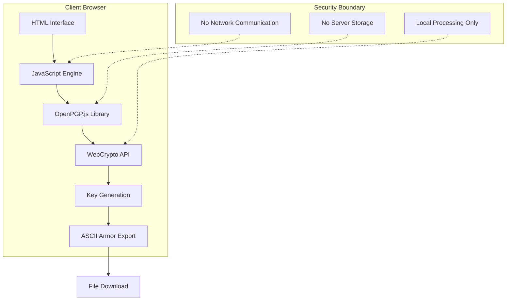

# xsukax GPG/PGP Key Generator

[](https://www.gnu.org/licenses/gpl-3.0)
[](https://github.com/xsukax/xsukax-GPG-PGP-Key-Generator)
[](https://openpgpjs.org/)

A secure, client-side GPG/PGP key generator with a modern terminal-inspired interface. Generate cryptographic key pairs entirely in your browser with zero server-side processing for maximum security and privacy.

## 🔐 Project Overview

The **xsukax GPG/PGP Key Generator** is a single-file web application designed for secure, client-side generation of GPG/PGP cryptographic key pairs. Built with privacy-first principles, this tool performs all cryptographic operations locally in your browser, ensuring your private keys never leave your device.

### Key Capabilities

- **Client-Side Cryptography**: Complete key generation using OpenPGP.js library
- **Modern Security**: ECC (Elliptic Curve Cryptography) with Curve25519 
- **ASCII-Armored Export**: Standard `.asc` format compatible with all GPG implementations
- **Optional Passphrase Protection**: Secure your private keys with custom passphrases
- **Terminal Aesthetic**: Professional command-line inspired user interface
- **Cross-Platform Compatibility**: Works on any modern web browser

## 🛡️ Security and Privacy Benefits

### Zero Trust Architecture


### Security Features

- **🔒 Client-Side Only**: All cryptographic operations occur within your browser
- **🚫 No Data Transmission**: Zero communication with external servers during key generation
- **🔑 Modern Cryptography**: Utilizes Curve25519 ECC for enhanced security and performance
- **💾 No Persistent Storage**: Application doesn't store any user data or generated keys
- **🔐 Passphrase Protection**: Optional encryption of private keys with user-defined passphrases
- **🛡️ Memory Safety**: Secure key handling with proper cleanup procedures

### Privacy Guarantees

- **Anonymous Usage**: No user tracking, analytics, or data collection
- **Offline Capable**: Can be downloaded and run without internet connectivity
- **Open Source**: Full transparency with publicly auditable source code
- **Self-Hostable**: Deploy on your own infrastructure for complete control

## ✨ Features and Advantages

### Core Features

- **🖥️ Terminal Interface**: Authentic command-line aesthetic with modern usability
- **🌗 Theme Toggle**: Switch between light and dark modes with preference persistence
- **📱 Mobile Responsive**: Optimized experience across all device types
- **⚡ Fast Generation**: Efficient key pair creation using modern ECC algorithms
- **📄 Standard Compliance**: Full compatibility with GNU Privacy Guard (GPG) and other OpenPGP implementations

### Unique Advantages

- **Single File Deployment**: Entire application contained in one HTML file
- **No Dependencies**: Self-contained with embedded cryptographic library
- **Instant Setup**: No installation required - runs immediately in any browser
- **Professional Design**: Clean, minimal interface suitable for enterprise environments
- **Educational Value**: Clear workflow demonstration for cryptographic concepts

## 🚀 Installation Instructions

### Method 1: Direct Usage (Recommended)

1. **Download the Application**
   ```bash
   wget https://raw.githubusercontent.com/xsukax/xsukax-GPG-PGP-Key-Generator/main/index.html
   ```

2. **Open in Browser**
   ```bash
   # Open the downloaded file in your preferred browser
   open index.html  # macOS
   xdg-open index.html  # Linux
   start index.html  # Windows
   ```

### Method 2: Clone Repository

1. **Clone the Repository**
   ```bash
   git clone https://github.com/xsukax/xsukax-GPG-PGP-Key-Generator.git
   cd xsukax-GPG-PGP-Key-Generator
   ```

2. **Launch Application**
   ```bash
   # Serve locally (optional, for HTTPS)
   python -m http.server 8000
   # Then visit: http://localhost:8000
   ```

### Method 3: Self-Hosting

1. **Deploy to Web Server**
   ```bash
   # Copy to web server directory
   cp index.html /var/www/html/keygen.html
   ```

2. **Configure HTTPS** (Recommended)
   - Ensure your web server supports HTTPS
   - Modern browsers may restrict cryptographic operations over HTTP

### System Requirements

- **Browser**: Any modern web browser (Chrome 63+, Firefox 57+, Safari 11+, Edge 79+)
- **JavaScript**: Must be enabled
- **Storage**: ~2MB for application and temporary key storage
- **Network**: Initial load only (for CDN library), then fully offline capable

## 📖 Usage Guide

### Basic Workflow



### Step-by-Step Instructions

#### 1. Initial Setup
```bash
$ generate-keypair --interactive
```
1. **Open the application** in your web browser
2. **Choose theme** using the toggle switch (optional)
3. **Verify secure connection** (HTTPS recommended for production use)

#### 2. User Information Entry
1. **Full Name**: Enter your complete name as it should appear in the key
2. **Email Address**: Provide the email associated with this key pair
3. **Validation**: Both fields are required and validated

#### 3. Passphrase Configuration (Optional)
```bash
$ configure-passphrase --protection=enabled
```
1. **Enable Protection**: Check the "Enable passphrase protection" option
2. **Enter Passphrase**: Choose a strong passphrase for private key encryption
3. **Security Note**: Passphrases add an additional security layer

#### 4. Key Generation Process
```bash
$ execute-keygen --algorithm=curve25519 --format=armored
```
1. **Click "Execute Key Generation"**
2. **Wait for Processing**: Cryptographic generation takes 2-5 seconds
3. **Success Confirmation**: Green checkmark indicates completion

#### 5. Key Export Operations
```bash
$ export-keys --format=asc --type=[public|private]
```

**Public Key Export:**
- Contains only public cryptographic material
- Safe to share openly
- Used by others to encrypt messages to you

**Private Key Export:**
- Contains sensitive cryptographic material
- Keep secure and confidential
- Required for decrypting messages

### Advanced Usage

#### Batch Key Generation
For multiple key pairs, repeat the process with different user information:



#### Integration with GPG
```bash
# Import generated public key
gpg --import user_public_key.asc

# Import generated private key
gpg --import user_private_key.asc

# Verify key import
gpg --list-keys
gpg --list-secret-keys
```

### Security Best Practices

1. **Environment Security**
   - Use on trusted devices only
   - Ensure secure browser environment
   - Clear browser cache after use

2. **Key Management**
   - Store private keys securely
   - Use strong, unique passphrases
   - Create backups of important keys
   - Never share private key material

3. **Operational Security**
   - Verify key fingerprints
   - Use secure communication channels
   - Regularly update your setup

## 🔧 Technical Architecture

### Component Overview


### Technology Stack

- **Frontend**: Vanilla HTML5, CSS3, JavaScript (ES2020+)
- **Cryptography**: OpenPGP.js v5.10.2
- **Algorithms**: Curve25519 ECC, AES encryption
- **Export Format**: ASCII-Armored (.asc) compatible with RFC 4880
- **Styling**: CSS Custom Properties with theme switching

## 📄 Licensing Information

This project is licensed under the **GNU General Public License v3.0** (GPL-3.0).

### License Summary

- **Freedom to Use**: Run the program for any purpose
- **Freedom to Study**: Access and examine the source code
- **Freedom to Modify**: Change the program to suit your needs
- **Freedom to Distribute**: Share copies with others
- **Copyleft Protection**: Derivative works must also be GPL-3.0 licensed

### Full License Text

See the [LICENSE](LICENSE) file for the complete GNU General Public License v3.0 text, or visit: https://www.gnu.org/licenses/gpl-3.0.html

### Third-Party Components

- **OpenPGP.js**: Licensed under LGPL-3.0-or-later
- **Web Standards**: Public domain specifications (HTML5, CSS3, ECMAScript)

---

## 🤝 Contributing

Contributions are welcome!

## ⭐ Acknowledgments

- **OpenPGP.js Team**: For the excellent cryptographic library
- **OpenPGP Working Group**: For maintaining the OpenPGP standard
- **Community Contributors**: For feedback, testing, and improvements

---

**Made with ❤️ for privacy and security**
